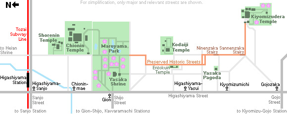

# Kyoto Trip

## Things to Do

## Itinerary ideas

### Central Kyoto
[Nishiki Market](https://goo.gl/maps/h7jTQXeezMYZ7Ygs7)
* Fresh food market street in central Kyoto
* `錦市場` / Nishiki Ichiba / Kyoto's Kitchen
* Hours: 10:00 ~ 18:00
* [Details](https://www.japan-guide.com/e/e3931.html)

### Eastern Kyoto Full Day

### Kiyomizudera Temple + Higashiyama District
[Kiyomizu-dera / 清水寺](https://goo.gl/maps/zDvdAWSbEpHUhWRL7)
* Temple with an iconic wooden stage
* [Details](https://www.japan-guide.com/e/e3901.html)

Higashiyama Streets
* Winding streets lined with traditional shophouses
* 

Kodaiji Temple
* Zen temple with impressive gardens

Gion
* Traditional neighbourhood

### Fushimi Inari Shrine
* [Fushimi Inari Shrine - Japan Guide](https://www.japan-guide.com/e/e3915.html)
* Google Maps: [Fushimi Inari Taisha / 伏見稲荷大社](https://goo.gl/maps/9e6EdUNDE18LuEwR7)

## References
* [Kyoto Travel Guide - What to do in Kyoto City](https://www.japan-guide.com/e/e2158.html)