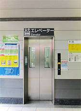

# Shibuya Station Notes

## Transferring Between Keio Inokashira Line and JR Lines with Elevators

Here is a quick guide for those traveling between the Keio Inokashira Line and JR lines at Shibuya Station with suitcases or strollers.

### Overview

| Step                                                                                                                                          | Photo                                                                         |
| --------------------------------------------------------------------------------------------------------------------------------------------- | ----------------------------------------------------------------------------- |
| Exit Keio Inokashira Line's platform via the "Central Ticket Gates".                                                                          |  |
| After exiting the gates Walk diagonally forward and left                                                                                      |
| Take the elevator marked "5" to the first floor (Ground Floor).  |
|                                                                  |
|                                                                                                                                               |  |
|                                                                                                                                               |  |
|                                                                                                                                               |  |
|                                                                                                                                               |  |
|                                                                                                                                               |  |

    * Inokashira Line's train cars 4 and 5 are closest to the "Central Exit Ticket Gates"
| , head towards the "Hachiko Exit". | 
    * 
|  | 
| After exiting the elevator, proceed straight, then turn left. | 
| Cross the intersection straight ahead. | 
| After crossing the intersection, turn right and follow the path towards "West Exit". | 
| Enter JR Shibuya via the "West Exit" and follow the blue arrows towards the "South Ticket Gates". | 
| Pass through the "South Ticket Gates" to reach the JR lines. | 
| Go straight ahead and around the corner to use the elevator to get to the platform level. | 

For the Yamanote Line, the elevator is located near the "South Ticket Gates" on the platform level.

For the Narita Express, take the elevator for platform 3 and 4.

⚠️ Warning: There are NO ELEVATOR to platform from Hachiko Gate.

* 
* 

## JR Shibuya Station Elevator Locations

Accessible route for exit with elevator
< JR Lines >

| Elevator between the platform and the gate level | Image                                                                                                                             |
| ------------------------------------------------ | --------------------------------------------------------------------------------------------------------------------------------- |
| Platform 1 and 2 to/from 3F Chuo Gate level      |   |
| Platform 1 to/from 1F South Gate level           |   |
| Platform 3・4 to/from 3F New South Gate level    |   |
| Platform 3・4 to/from 3F Chuo Gate level         |   |

## Reference

* [【渋谷駅】井の頭線から山手線・埼京線・湘南新宿ラインへの乗り換えルート](https://wadattsu261.com/content/shibuya-keioinokashiraline-jrline-transfer-information/)
* [Shibuya Station - Accessible Travel Japan](https://accessible-japan.jp/tokyo/shibuya_shibuya_sta.html)
